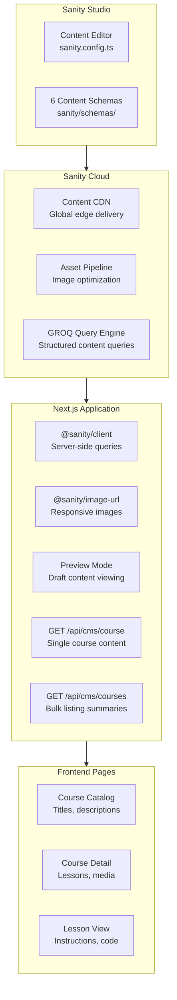
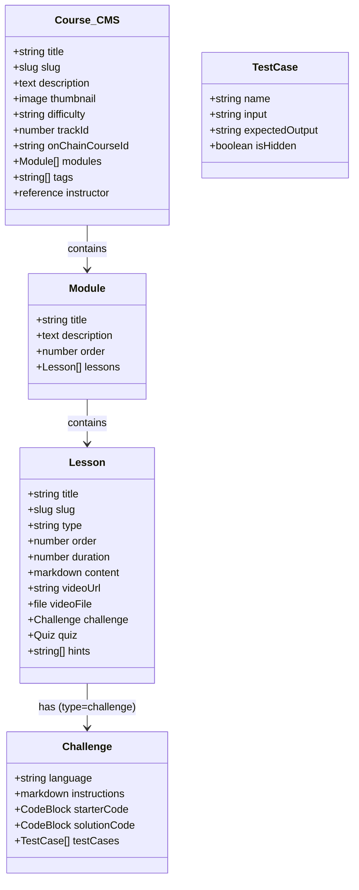
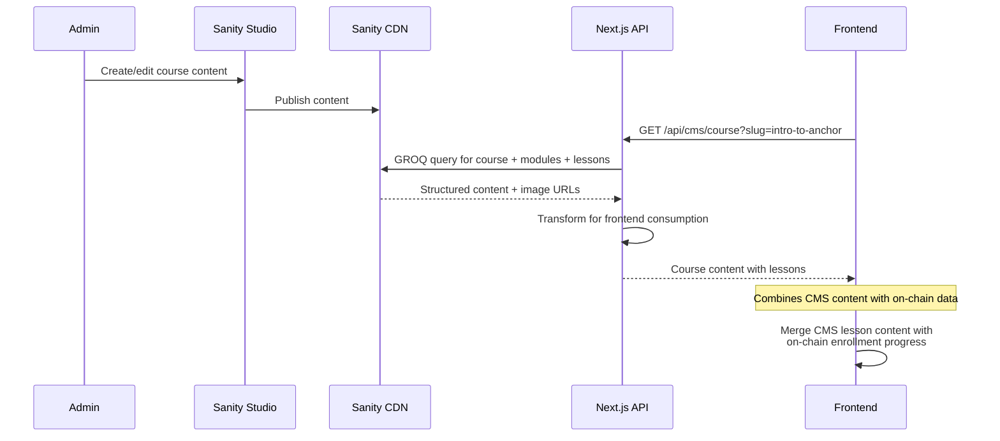
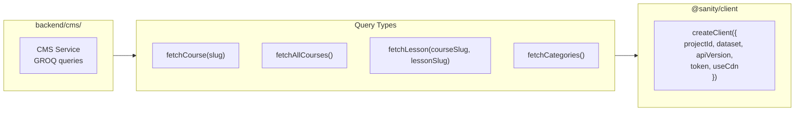
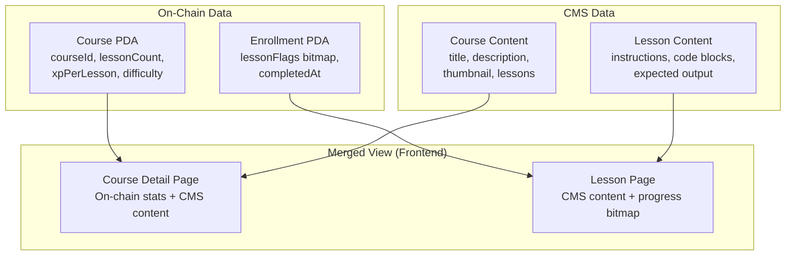

# CMS and Content Management

## Table of Contents

- [CMS Architecture](#cms-architecture)
- [Sanity Configuration](#sanity-configuration)
- [Content Schemas](#content-schemas)
- [Content Pipeline](#content-pipeline)
- [CMS API Integration](#cms-api-integration)
- [Content Delivery](#content-delivery)

---

## CMS Architecture



---

## Sanity Configuration

### Project Configuration

| Setting | Value |
|---|---|
| Config file | `sanity.config.ts` |
| CLI config | `sanity.cli.ts` |
| Project ID | `SANITY_PROJECT_ID` env var |
| Dataset | `production` (configurable) |
| API Version | Latest |
| Plugins | `sanity-plugin-markdown`, `@sanity/code-input` |

### Schema Directory

```
sanity/
  schemas/         # 6 content type schemas
```

### Environment Variables

| Variable | Required | Description |
|---|---|---|
| `SANITY_PROJECT_ID` | Yes | Sanity project identifier |
| `SANITY_DATASET` | Yes | Dataset name (production) |
| `SANITY_API_TOKEN` | Yes | API token for server queries |
| `SANITY_PREVIEW_SECRET` | No | Secret for preview mode |

---

## Content Schemas

### Course Content Model



### Lesson Types

| Type | Sanity Fields | Rendered By |
|------|--------------|-------------|
| `content` | `content` (markdown) | `LessonContent` + `CodeEditor` |
| `video` | `videoUrl` (YouTube/Vimeo) or `videoFile` (mp4/webm/mov upload) | `LessonContent` + `VideoPlayer` |
| `challenge` | `challenge.language`, `instructions`, `starterCode`, `solutionCode`, `testCases[]` | `LessonContent` + `ChallengePanel` |

### Content Types

| Schema | Purpose | Key Fields |
|---|---|---|
| Course | Course definition and metadata | title, slug, description, modules, trackId, onChainCourseId |
| Module | Course section grouping | title, description, order, lessons |
| Lesson | Individual lesson (3 types) | title, type (content/video/challenge), content, videoUrl, challenge |
| Instructor | Course creator profile (CMS metadata) | name, bio, avatar, social links |
| Track | Learning track definition | name, slug, onChainTrackId, color, icon |
| Announcement | Platform announcements | title, body, priority, expiry |

---

## Content Pipeline

### Content Creation to Display



### Content Caching Strategy

| Content Type | Cache Strategy | TTL |
|---|---|---|
| Course metadata | CDN + Next.js cache | 60 seconds |
| Lesson content | CDN + on-demand | 60 seconds |
| Images | Sanity CDN | Long-lived |
| Draft content | No cache (preview mode) | Real-time |

---

## CMS API Integration

### Backend CMS Service



---

## Content Delivery

### On-Chain + CMS Content Merge



| Data Field | Source | Description |
|---|---|---|
| Course title, description | Sanity CMS | Rich-formatted content |
| Course thumbnail | Sanity CDN | Optimized images |
| Lesson content, code blocks | Sanity CMS | Markdown + code snippets |
| Lesson count, XP per lesson | On-chain | Immutable program data |
| Enrollment status | On-chain | PDA account state |
| Lesson completion progress | On-chain | Bitmap in Enrollment PDA |
| Total enrollments/completions | On-chain | Course PDA counters |
